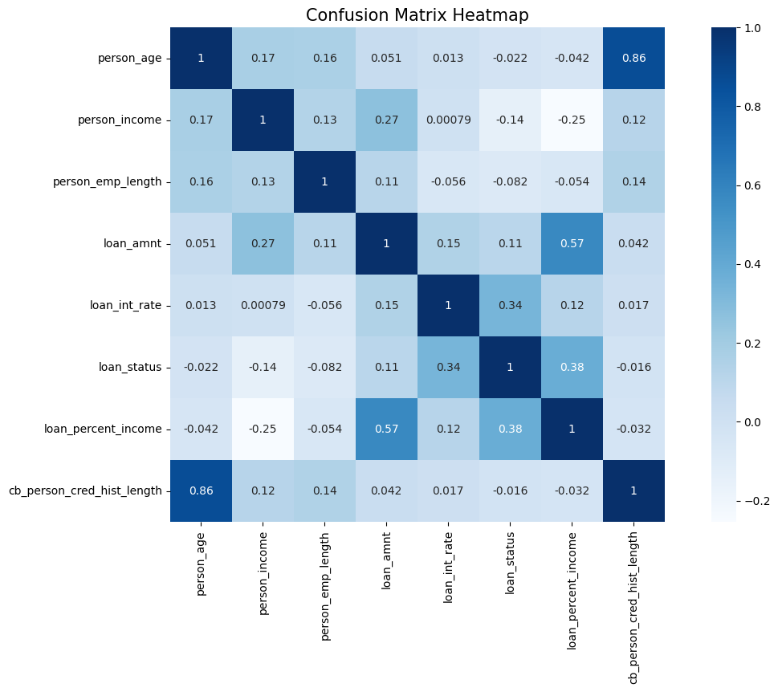
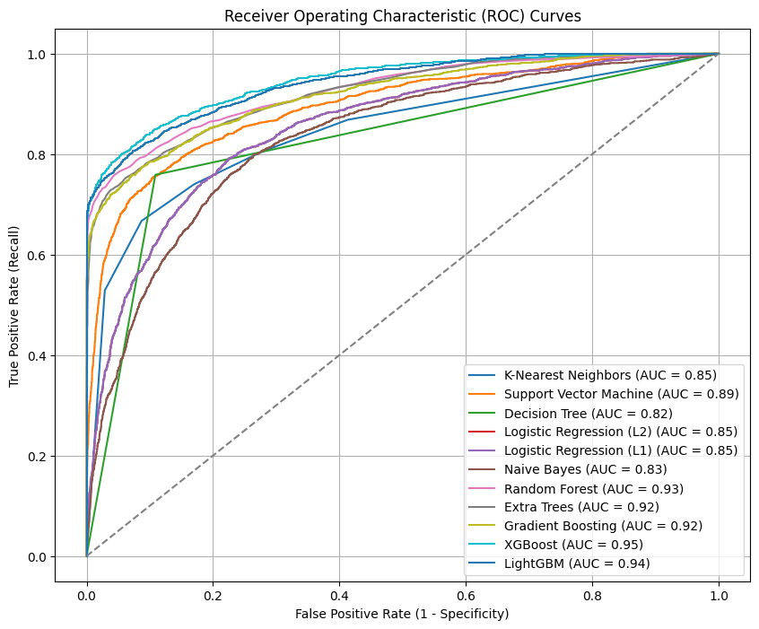

# Credit Risk Assessment – Machine Learning Project

## Executive Summary

In the highly competitive lending industry, incorrectly identifying defaulters leads to significant financial losses, while rejecting reliable borrowers results in missed revenue opportunities. Financial institutions must strike a careful balance between risk mitigation and growth.

This project develops a robust machine learning–based credit risk assessment system designed to:

- Accurately identify high-risk borrowers  
- Prioritize recall to minimize costly false negatives  
- Maintain acceptable precision to avoid excessive rejection of safe applicants  
- Align model optimization directly with business risk objectives  

The final solution leverages **XGBoost with Bayesian hyperparameter optimization**, achieving improved F-beta performance while handling severe class imbalance.

---

## Table of Contents

- [Business Context](#business-context)
- [Project Structure](#project-structure)
- [Data Overview](#data-overview)
- [Exploratory Data Analysis](#exploratory-data-analysis)
- [Data Cleaning & Feature Engineering](#data-cleaning--feature-engineering)
- [Modeling & Evaluation](#modeling--evaluation)
- [Handling Imbalanced Data](#handling-imbalanced-data)
- [Hyperparameter Optimization](#hyperparameter-optimization)
- [ROC & Performance Analysis](#roc--performance-analysis)
- [Installation](#installation)
- [Usage](#usage)
- [Business Impact](#business-impact)
- [Future Improvements](#future-improvements)

---

# Business Context

## The Problem

Traditional credit risk assessment relies on:

- Manual underwriting  
- Fixed credit score cutoffs  
- Income thresholds  
- Rule-based systems  

These approaches fail to capture:

- Non-linear borrower behavior  
- Complex feature interactions  
- Evolving risk patterns  

As a result, institutions either:

- Approve risky borrowers (financial loss), or  
- Reject reliable customers (lost revenue)

---

## Objective

Predict loan status:

- `0` → Non-default  
- `1` → Default  

**Business Priority:**  
Missing a defaulter (False Negative) is more costly than incorrectly flagging a safe borrower.

Therefore, the model was optimized using:

- **F-beta score (β = 1.5)**  
- Emphasis on Recall  
- Balanced Precision  

This reflects a real-world 70/30 tradeoff favoring recall.

---

# Project Structure


The project includes the following files and directories:

- `Credit_Risk_Assesment.ipynb`: Jupyter notebook containing the complete codebase and analysis for assessing credit risk.
- `Credit_Risk_AI.ipynb`: Jupyter notebook integrating a language model AI to address your questions and concerns about the credit risk process.
- `Credit_Risk_KPI.ipynb`:Jupyter notebook focused on data analysis, showcasing critical Key Performance Indicators (KPIs) related to credit card data.
- `Credit_Risk_Test.ipynb`: A notebook where you can interactively test the developed model to predict whether a customer (or yourself) is likely to default.
- `README.md`: Detailed description of the project.
- `datasets`: Directory designated for storing datasets and associated pickle files.
- `models/`: Directory for saving trained machine learning models.
- `images/`: Directory to save plots and visualizations.


---

# Data Overview

Dataset Source: Kaggle (anonymized financial lending dataset)

Features include:

- Age  
- Income  
- Employment length  
- Loan amount  
- Loan interest rate  
- Loan intent  
- Loan grade  
- Home ownership type  
- Credit history length  
- Historical default status  

All personally identifiable information was removed.

---

# Exploratory Data Analysis

  


The correlation matrix revealed:

- Moderate correlations between loan amount and income percentage  
- Positive relationship between interest rate and default risk  
- No severe multicollinearity issues  

---

## Class Distribution

  


Key Observation:

The dataset is heavily imbalanced, with significantly more non-defaulters than defaulters — a common real-world credit dataset challenge.

---

# Data Cleaning & Feature Engineering

## Missing Value Treatment

- Employment length → Mean imputation  
- Loan-type missing entries → Removed  
- Duplicate records → Dropped  

---

## Outlier Handling

Unrealistic values identified via box plots:

- Age > 120 years  
- Employment length > 120 years  

These were treated as data-entry errors and replaced using mean values.

---

## Encoding Strategy

- Label Encoding used for categorical variables:
  - Loan intent  
  - Loan grade  
  - Home ownership  

One-hot encoding was avoided to prevent dimensionality explosion.

---

## Feature Scaling

All features were standardized to improve performance of:

- Logistic Regression  
- SVM  
- KNN  

---

# Modeling & Evaluation

## Train-Test Split

- 75% Training  
- 25% Testing  

---

## Models Evaluated

- K-Nearest Neighbors  
- Support Vector Machine  
- Logistic Regression (L1 & L2)  
- Decision Tree  
- Random Forest  
- Extra Trees  
- LightGBM  
- XGBoost  

---

# Handling Imbalanced Data

Because defaulters are the minority class but most important for risk mitigation:

Applied:

- **SMOTE (Synthetic Minority Over-sampling Technique)**  
- Class weighting  
- F-beta scoring  

SMOTE significantly improved minority class learning.

---

# Hyperparameter Optimization





Used:

- `GridSearchCV` to optimize SMOTE ratio (Optimal: 0.66)  
- `BayesSearchCV` (Bayesian Optimization) to tune XGBoost  

Bayesian Optimization was selected because it:

- Learns from previous trials  
- Models performance probabilistically  
- Finds optimal hyperparameters faster than brute-force search  

Optimized Parameters:

- Max depth: 14  
- Learning rate: 0.26  
- Estimators: 81  

Result:

- ~2% improvement in F-beta score  
- Final F-beta ≈ 0.79  

---

# ROC & Performance Analysis


Final Model Performance:

- Accuracy: ~93%  
- F-beta (β = 1.5): ~0.79  
- Strong Recall (business priority)  
- High ROC-AUC  

The model successfully improves identification of high-risk borrowers while maintaining acceptable precision.

---

# Installation

```bash
git clone https://github.com/your-username/credit-risk-analysis.git
cd credit-risk-analysis
pip install -r requirements.txt
